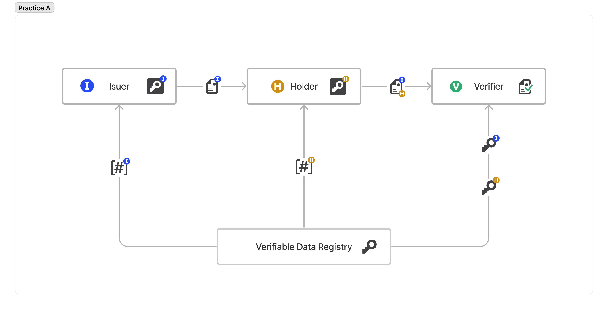

# Issuerが発行された証明書をHolderがVerifierに提示

Issuer, Holder, Verifier がそれぞれ別のエンティティの方式。
IssuerがHolderに対して電子署名を施した属性の証明書を発行し、Holderは発行された証明書に自身の電子署名を施したものを、Verifierに提示することにより、HolderはVerifierに対して属性の証明を行うことができる。
VerifierはIssuerおよびHolderの電子署名を検証することにより、Issuerが発行したHolderの属性の証明書であることを確認することができる。

eKYCによる本人確認や学生証による学割等のユースケースが考えられる。

* [学生証を用いた学割のユースケース](./学生証を用いた学割のユースケース.md)

> [!WARNING]
> * 図では、VDRがIssuer/Holderで共通だが、IssuerとHolderでDIDメソッドが異なるケースや、IssuerはVDRを使わないがHolderは使うケースもありうる