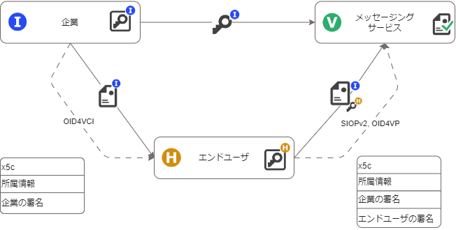
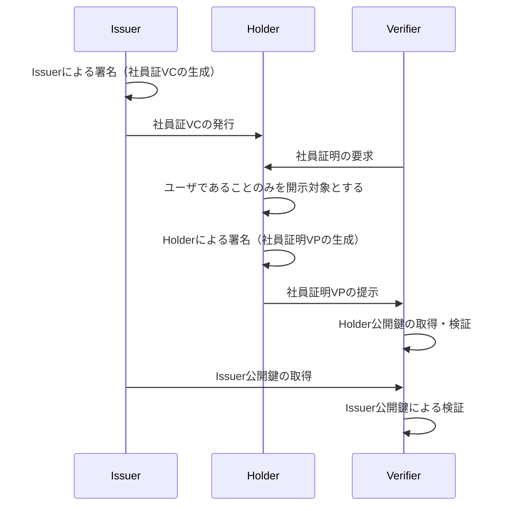

# ウォレットを用いたオンラインコミュニケーション

- [ウォレットを用いたオンラインコミュニケーション](#ウォレットを用いたオンラインコミュニケーション)
  - [解決する課題](#解決する課題)
    - [個人におけるメッセージングの課題](#個人におけるメッセージングの課題)
    - [ビジネスにおけるメッセージングの課題](#ビジネスにおけるメッセージングの課題)
  - [どのように解決するか](#どのように解決するか)
    - [解決するための要件と技術選定](#解決するための要件と技術選定)
  - [実装](#実装)
    - [前提](#前提)
    - [シーケンス](#シーケンス)
  - [メリット（ペインポイントの解消）](#メリットペインポイントの解消)
  - [注意点](#注意点)
  - [Trusted Webの目指すべき方向性との対応](#trusted-webの目指すべき方向性との対応)
  - [アーキテクチャとの対応](#アーキテクチャとの対応)

オンラインコミュニケーションにおけるサービス登録を例に説明する。本ケースでは、Issuerが企業、Holderが従業員（ユーザ）、Verifierがメッセージングサービスを実施するサービス事業者となる。

## 解決する課題

### 個人におけるメッセージングの課題

Bobは、知り合いのAliceと連絡を取るために、メッセージングサービスを利用しようとしている。しかし、メッセージングサービスサービスに登録する際に電話番号を登録することで広告が送信されるかもしれないと思い、また、送信相手が本当に意図した相手かわからないという不安があり、躊躇している。

- 個人のペインポイント
  1. 電話番号を提供するとターゲティング広告に利用されるかもしれない
  2. 登録、通信相手が意図した人物であるか検証できない

### ビジネスにおけるメッセージングの課題

Bobは、メールで相手先企業の担当者Aliceとやり取りする際に、メッセージの内容が通常では暗号化されておらず、PPAPと呼ばれるパスワード付きzipファイルを添付し、パスワードを別送してしまっている。
この課題を解決しようとチャットツール等を導入検討したが、相手先企業ごとに異なるツールを導入しているため、複数のチャットツールの導入し、常にこれらのチャットツールを確認することは避けたく、また、社内規則で利用できないチャットツールもあり、躊躇している。

- ビジネスのペインポイント
  1. 相互運用性のあり、安全なメッセージングサービスを利用したい
  2. 特定のプラットフォームにメッセージングの安全性を依存してしまっている

## どのように解決するか

### 解決するための要件と技術選定

上記のペインポイントを解決するための要件に対し、解決に資する技術選定を行った。

1. 属性情報の一部のみ開示できること
    > 選択的属性開示が可能な証明書形式であるSD-JWT[^1]を用いる。
2. unlinkableな仕組みであること
    > HolderからVerifierに提供する識別子は、JWK Thumbprint[^2]を用いる。
3. 相互運用性のある仕組みであること
    > EUDIWやOWFで採用が予定されているアイデンティティ・ウォレットに関する国際標準技術を組み合わせる。
    > 他のメッセージングサービスとの連携の強みをもつ、分散型のメッセージングプロトコルであるMatrix[^3]を用いる
4. 安全にメッセージをやり取りできること
    > E2E暗号化の実装、鍵管理の仕組みの強みをもつ、分散型のメッセージングプロトコルであるMatrixを用いる。
5. メッセージのやり取りが特定のサービス事業者に依存していないこと
    > 暗号化機能に優れており、仕様内容やその変更に関する手続きが明確に定義されているであるMatrixを用いる。

上記選定技術を用いた構成を図示したものが以下となる。

Issuerが企業、Holderが従業員（ユーザ）、Verifierがメッセージングサービスを提供する事業者となるように、企業の発行した電子社員証の一部（現在企業に所属しているという情報）をユーザがメッセージングサービスに提示するように実装を行う。その際のおおまかなデータのやり取りの流れは以下のようになる。

1. Issuerである企業がHolderであるユーザに対して、企業の電子署名を施した電子社員証を発行する = Verifiable Credentials[^4]（以下、VC）の発行
2. Holderであるユーザは発行された電子社員証から、現在従業員であるという情報を取り出し、自身の電子署名を行う = Verifiable Presentation（以下、VP） の作成
3. ユーザはウェブサイトを経由してVerifierであるメッセージングサービスを送付する
4. メッセージングサービスは受け取った電子証明書に記載されている企業の所属情報、電子社員証をもとにx5c証明書からIssuerの公開鍵、JWK Thumbprintを利用してHolderの公開鍵を取得し、企業およびユーザの署名を検証する

## 実装

### 前提
- Issuerである企業はSD-JWT形式のVCをOID4VCI[^5]プロトコルを用いて発行するシステムを保有している
- HolderであるユーザはSD-JWT形式のVCに対応したデジタルアイデンティティウォレットを保有している
- VerifierであるメッセージングサービスはOID4VP[^6]プロトコルを用いたVPの受領に対応し、SD-JWT形式のVCを検証できるシステムを保有している

### シーケンス

1. Issuerである企業がHolderであるユーザを認証する
    - 既に企業が運用を行っているポータル等へのログイン、もしくは対面をもって、ユーザの認証を行う

2. 企業が認証されたユーザに対して、企業の電子署名を施した電子社員証を発行する
    - X.509サーバ証明書をx5cヘッダに含んだSD-JWT形式のVCを発行し、OID4VCIプロトコルでユーザのデジタルアイデンティティウォレットに対して電子社員証を発行する

3. ユーザはメッセージングサービスのウェブサイトから学割の申請を行う
    - メッセージングサービスの提示したQRコードをユーザがデジタルアイデンティティウォレットでスキャンすることにより、OID4VPプロトコルで証明書がリクエストされる

4. ユーザはデジタルアイデンティティウォレットに保存された電子社員証から、現在ユーザであることを証明できる情報を取り出し、自身の電子署名を行う
    - SD-JWT形式のVCの中から、企業名および有効期限の情報を取り出し、自身の署名を行い、VPを作成する

5. VerifierであるメッセージングサービスにVPを送付する
    - ユーザは送付される情報や送信先のメッセージングサービスの情報について確認を行い、デジタルアイデンティティウォレットを経由してOID4VPプロトコルでメッセージングサービスにVPを送付される

6. メッセージングサービスは受け取った電子証明書に記載されている企業の属性情報をもとに、Issuerから公開鍵を取得し、電子証明書の識別子をもとに署名から公開鍵を取得し、企業およびユーザの署名を検証する
    - 企業のURLから `/.well-known/jwks.json`に配置された公開鍵、および電子証明書のJWK Thumbprintから取得した公開鍵を用いて署名の検証を行う。

## メリット（ペインポイントの解消）

 - Issuer（企業）のメリット
    - オフラインの社員証と同様、一度発行すれば、ユーザかどうかを確認するたびに、都度認証を行うための仕組みを構築する必要が無い
    - 特定のプラットフォームにメッセージングの安全性を依存を回避できる。
      > [企業のペインポイント](#ビジネスにおけるメッセージングの課題)の解消

 - Holder（ユーザ）のメリット
    - （選択的開示に対応したVCを用いることで）余計な情報を渡す必要が無い
      > [ユーザのペインポイント](#個人におけるメッセージングの課題)の解消
    - なりすましを（ある程度）防ぐことができる
      > [ユーザのペインポイント](#個人におけるメッセージングの課題)の解消
    - 社員証の提示をいつ、どこに対して行ったか、を企業に知られない

 - Verifier（メッセージングサービス）のメリット
    - なりすましを（ある程度）防ぐことができる
      > [ユーザのペインポイント](#個人におけるメッセージングの課題)の解消
    - （選択的開示に対応したVCを用いることで）余計な情報を管理する必要が無い

## 注意点

 - 選択的開示に対応していないVCの場合は、社員証に記載されたすべての情報をVerifierに渡す必要があることに留意が必要
 - 複数のVerifierに対して証明書を提示した場合、選択的開示に対応しているSD-JWTであってもVerifier同士で名寄せが可能であることに留意が必要（SD-JWTではなく、JSON-LD ZKP with BBS+等の技術を用いることで名寄せを防止することも可能）
 - デジタルアイデンティティウォレットはHolder本人しか操作できないことを担保する必要がある
 - 企業の実在性を担保するためにはOV証明書のように審査を設ける等の仕組みの導入が必要となる
 - 企業が本当に本人に対して電子社員証を発行していることを担保するために、企業がユーザ本人かどうかを確認する手順が別途必要となる

## Trusted Webの目指すべき方向性との対応

* ユーザ（自然人又は法人）自身が自らに関連するデータをコントロール
  * デジタルアイデンティティウォレットによってユーザ自身で証明書を管理でき、社員証の提示をいつ、どこに対して行ったか、を企業に知られない
  * 選択的に属性情報を開示することにより、必要最低限の情報をメッセージングサービスに提示できる
  
* データのやり取りにおける合意形成の仕組み
  * OID4VPプロトコルを利用することにより、Verifierからの証明書リクエストに対してデジタルアイデンティティウォレットを通じて、提供する情報と提供先（提供先での利用目的等を含むことができる）について合意を行う
    
* その合意の履行のトレースを可能	
  * デジタルアイデンティティウォレットにおいて、提供した情報と提供先の履歴を確認する機能を備えることにより、一部トレースが可能

* 検証（verify）できる領域を拡大する	
  * SMS等の確認から電子証明書によるデジタル確認

## アーキテクチャとの対応

* Verifiable Identity	
  * OV証明書による企業の実在証明、社員の所属証明
* Verifiable Data
  * SD-JWT形式の電子社員証に記載されている情報（企業名・事業部名・役職等）
* Verifiable Messaging	
  * OID4VCI
  * OID4VP
* Verifiable Identity Community	
  * 一連の電子社員証のやりとりについて、企業、ユーザの実在性の確認やユーザの本人確認、メッセージングサービスでの検証方法について合意を行ったエンティティの集合

[^1]: Selective Disclosure for JWTs (SD-JWT) https://datatracker.ietf.org/doc/
[^2]: JSON Web Key (JWK) Thumbprint https://openid-foundation-japan.github.io/rfc7638.ja.html
[^3]: Matrix https://github.com/matrix-org
[^4]: Verifiable Credentials Data Model v1.1 https://www.w3.org/TR/vc-data-model/
[^5]: OpenID for Verifiable Credential Issuance https://openid.net/specs/openid-4-verifiable-credential-issuance-1_0.html
[^6]: OpenID for Verifiable Presentations - draft 18 https://openid.net/specs/openid-4-verifiable-presentations-1_0.html
