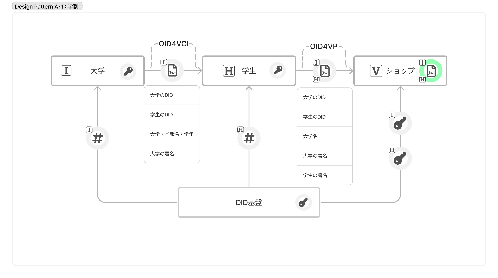
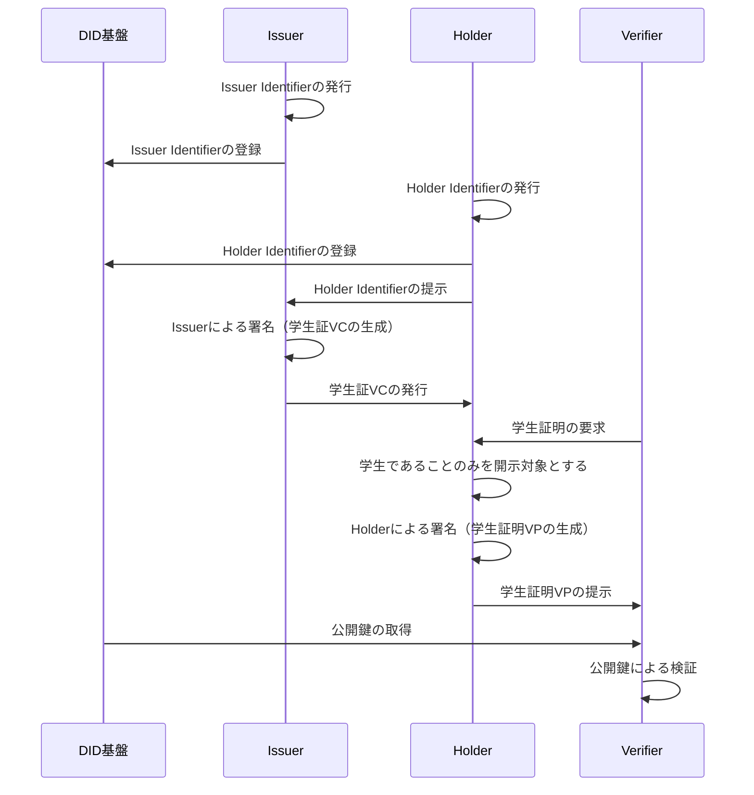

# 学生証を用いた学割のユースケース

- [学生証を用いた学割のユースケース](#twdp-a学生証を用いた学割のユースケース)
  - [解決する課題](#解決する課題)
  - [どのように解決するか](#どのように解決するか)
    - [解決するための要件と技術選定](#解決するための要件と技術選定)
  - [実装](#実装)
    - [前提](#前提)
    - [シーケンス](#シーケンス)
  - [メリット](#メリット)
  - [注意点](#注意点)
  - [Trusted Webの目指すべき方向性との対応](#trusted-webの目指すべき方向性との対応)
  - [アーキテクチャとの対応](#アーキテクチャとの対応)

オンラインにおける学生割引を例に説明する。この場合Issuerが大学、Holderが学生、Verifierが学割を実施するオンラインショップとなる。

## 解決する課題

### 学生の課題

〇✕大学の学生である太郎君は、新しいパソコンを買うために、学割キャンペーンを実施しているオンラインショップで購入しようとしている。しかし、学生証の画像の送付を求められ面倒に感じ、またオンラインショップの情報の管理に対して不安感があり、躊躇している。

- 学生のペインポイント
  - ① 画像を撮影して送付するのは面倒
  - ② 顔写真等の情報もあり、何に使われるかわからず不安

### オンラインショップの課題

オンラインショップは学生であることを確認するために、学生証の画像の送付を求めており、受け取った画像はクラウドストレージに保存して、目視で有効期限を確認しているが、運用が面倒な上に、本当に本人の学生証かを確認する方法も無く、画像などの情報の漏洩の懸念から学割キャンペーンは終了しようとしている。

- オンラインショップのペインポイント
  - ① 目視確認の運用コストが高い
  - ② 別人の学生証の画像の可能性はあるが、そこは目をつむっている
  - ③ 画像には個人情報が含まれているため管理コストが高い

## どのように解決するか

### 解決するための要件と技術選定

上記のペインポイントを解決するための要件に対し、解決に資する技術選定を行った。

1. 学生はオンラインで学生であることを簡単に証明できること
    > OID4VP[^1]で定義されているCross Device Flowを用いることで、スマホから簡単に証明書を提示できる。
1. 証明書の提示・検証する際に、オンラインショップから大学に都度確認が行われないこと
    > Verifiable Credentials Data Model[^2]を採用することで、大学側で都度認証を行う必要のないシステムを構築できる。
1. 最小限の情報（学生であること）のみをオンラインショップに提示できること
    > 証明書の形式としてSD-JWT[^3]を用いることで、選択的に必要な情報のみを証明できる。
1. オンラインショップは学生であることを簡単に検証できること
    > Verifiable Credentials Data Modelを採用することで、オンラインショップは大学の公開鍵を入手することで、簡単に検証ができる。公開鍵基盤にはDID[^4]を用いる
1. なりすましを防止できること
    > SD-JWTにHolder Binding JWT[^5]を含めることで、オンラインショップは提示された証明書が提示した本人のものかどうかを確認できる。
1. 一連の技術実装には国際標準仕様（予定含む）を用いること
    > 上記のそれぞれの技術はW3CおよびIETFによって標準化されている。

上記選定技術を用いた構成を図示したものが以下となる。

Issuerが大学、Holderが学生、Verifierが学割を実施するオンラインショップとなるように、大学の発行した電子学生証の一部（現在学生であるという情報）を学生がオンラインショップに提示するように実装を行う。その際のおおまかなデータのやり取りの流れは以下のようになる。

1. Issuerである大学がHolderである学生に対して、大学の電子署名を施した電子学生証を発行する = Verifiable Credentialsの発行
1. Holderである学生は発行された電子学生証から、現在学生であるという情報を取り出し、自身の電子署名を行う = Verifiable Presentation の作成
1. 学生はウェブサイトを経由してVerifierであるオンラインショップに送付する
1. オンラインショップは受け取った電子証明書に記載されている大学の属性情報、電子学生証をもとにDID基盤(VDR)から公開鍵を取得し、大学および学生の署名を検証する

## 実装

### 前提
- Issuerである大学はSD-JWT形式のVCをOID4VCI[^6]プロトコルを用いて発行するシステムを保有している
- Holderである学生はSD-JWT形式のVCに対応したデジタルアイデンティティウォレットを保有している
- VerifierであるオンラインショップはOID4VPプロトコルを用いたVPの受領に対応し、SD-JWT形式のVCを検証できるシステムを保有している

### シーケンス

1. Issuerである大学がHolderである学生を認証する
    - 既に大学が運用を行っている大学ポータル等へのログインをもって、学生の認証を行う

1. 大学が認証された学生に対して、大学の電子署名を施した電子学生証を発行する
    - Holder Binding JWTを含んだSD-JWT形式のVCを発行し、OID4VCIプロトコルで学生のデジタルアイデンティティウォレットに対して電子学生証を発行する

1. 学生はオンラインショップのウェブサイトから学割の申請を行う
    - オンラインショップの提示したQRコードを学生がデジタルアイデンティティウォレットでスキャンすることにより、OID4VPプロトコルで証明書がリクエストされる

1. 学生はデジタルアイデンティティウォレットに保存された電子学生証から、現在学生であることを証明できる情報を取り出し、自身の電子署名を行う
    - SD-JWT形式のVCの中から、大学名および有効期限の情報を取り出し、自身の署名を行い、VPを作成する

1. VerifierであるオンラインショップにVPを送付する
    - 学生は送付される情報や送信先のオンラインショップの情報について確認を行い、デジタルアイデンティティウォレットを経由してOID4VPプロトコルでオンラインショップにVPを送付される

1. オンラインショップは受け取った電子証明書に記載されている大学の属性情報、電子学生証をもとにDID基盤から公開鍵を取得し、大学および学生の署名を検証する
    - 大学および学生のDIDからDID documentを取得し、公開鍵を用いて署名の検証を行う。

## メリット（ペインポイントの解消）

 - Issuer（大学）のメリット
    - オフラインの学生証と同様、一度発行すれば、学生かどうかを確認するたびに、都度認証を行うための仕組みを構築する必要が無い

 - Holder（学生）のメリット
    - 学生証を撮影する必要がない
      > [学生のペインポイント①](#学生の課題)の解消
    - （選択的開示に対応したVCを用いることで）余計な情報を渡す必要が無い
      > [学生のペインポイント②](#学生の課題)の解消
    - 学生証の提示をいつ、どこに対して行ったか、を大学に知られない

 - Verifier（オンラインショップ）のメリット
    - 目視での確認等の面倒な作業を行わなくても良い
      > [オンラインショップのペインポイント①](#オンラインショップの課題)の解消
    - なりすましを（ある程度）防ぐことができる
      > [オンラインショップのペインポイント②](#オンラインショップの課題)の解消
    - （選択的開示に対応したVCを用いることで）余計な情報を管理する必要が無い
      > [オンラインショップのペインポイント③](#オンラインショップの課題)の解消

## 注意点

 - 選択的開示に対応していないVCの場合は、学生証に記載されたすべての情報をVerifierに渡す必要があることに留意が必要
 - 複数のVerifierに対して証明書を提示した場合、選択的開示に対応しているSD-JWTであってもVerifier同士で名寄せが可能であることに留意が必要（SD-JWTではなく、JSON-LD ZKP with BBS+等の技術を用いることで名寄せを防止することも可能）
 - デジタルアイデンティティウォレットはHolder本人しか操作できないことを担保する必要がある
 - 大学の実在性を担保するためにはDID基盤からIdentifierを発行する際に、審査を設ける等の仕組みの構築が必要となる
 - 大学が本当に本人に対して電子学生証を発行していることを担保するために、大学が学生本人かどうかを確認する手順が別途必要となる

## Trusted Webの目指すべき方向性との対応

* ユーザ（自然人又は法人）自身が自らに関連するデータをコントロール
  * デジタルアイデンティティウォレットによってユーザ自身で証明書を管理でき、学生証の提示をいつ、どこに対して行ったか、を大学に知られない
  * 選択的に属性情報を開示することにより、必要最低限の情報をオンラインショップに提示できる
  
* データのやり取りにおける合意形成の仕組み
  * OID4VPプロトコルを利用することにより、Verifierからの証明書リクエストに対してデジタルアイデンティティウォレットを通じて、提供する情報と提供先（提供先での利用目的等を含むことができる）について合意を行う
    
* その合意の履行のトレースを可能	
  * デジタルアイデンティティウォレットにおいて、提供した情報と提供先の履歴を確認する機能を備えることにより、一部トレースが可能

* 検証（verify）できる領域を拡大する	
  * 目視確認から電子証明書によるデジタル確認

## アーキテクチャとの対応

* Entity
  * 大学・学生・オンラインショップ
* Verifiable Identity	
  * DID基盤から発行されたIDと、そのIDに発行された電子学生証
* Verifiable Data
  * SD-JWT形式の電子学生証に記載されている情報（大学名・学部名・学年等）
* Verifiable Messaging	
  * TLS
  * OID4VCI
  * OID4VP
* Verifiable Data Community	
  * 一連の電子学生証のやりとりについて、大学生の実在性の確認や学生の本人確認、オンラインショップでの検証方法について合意を行ったエンティティの集合

[^1]: OpenID for Verifiable Presentations - draft 18 https://openid.net/specs/openid-4-verifiable-presentations-1_0.html
[^2]: Verifiable Credentials Data Model v1.1 https://www.w3.org/TR/vc-data-model/
[^3]: Selective Disclosure for JWTs (SD-JWT) https://datatracker.ietf.org/doc/draft-ietf-oauth-selective-disclosure-jwt/
[^4]: Decentralized Identifiers (DIDs) v1.0 https://www.w3.org/TR/did-core/
[^5]: Holder Binding JWT https://www.ietf.org/id/draft-terbu-sd-jwt-vc-02.html#name-holder-binding-jwt-4
[^6]: OpenID for Verifiable Credential Issuance https://openid.net/specs/openid-4-verifiable-credential-issuance-1_0.html
