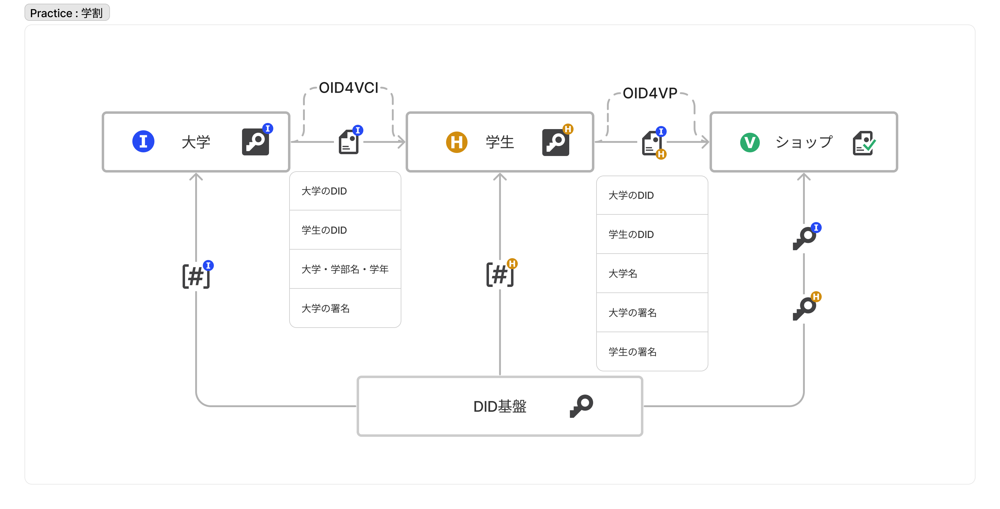

# TWDP-A：学生証を用いた学割のユースケース

- [TWDP-A：学生証を用いた学割のユースケース](#twdp-a学生証を用いた学割のユースケース)
  - [解決する課題](#解決する課題)
  - [どのように解決するか](#どのように解決するか)
  - [実装](#実装)
    - [前提](#前提)
    - [シーケンス](#シーケンス)
  - [メリット](#メリット)
  - [注意点](#注意点)
  - [Trusted Webの目指すべき方向性との対応](#trusted-webの目指すべき方向性との対応)
  - [アーキテクチャとの対応](#アーキテクチャとの対応)

オンラインにおける学生割引を例に説明する。この場合Issuerが大学、Holderが学生、Verifierが学割を実施するオンラインショップとなる。

## 解決する課題

- 学生（Holder）の課題
    〇✕大学の学生である太郎君は、新しいパソコンを買うために、学割キャンペーンを実施しているオンラインショップで購入しようとしている。しかし、学生証の画像の送付を求められ面倒に感じ、またオンラインショップの情報の管理に対して不安感があり、躊躇している。

    > ペインポイント
    ・画像を撮影して送付するのは面倒
    ・顔写真等の情報もあり、何に使われるかわからず不安

- オンラインショップ（Verifier）の課題
    オンラインショップは学生であることを確認するために、学生証の画像の送付を求めており、受け取った画像はクラウドストレージに保存して、目視で有効期限を確認しているが、運用が面倒な上に、本当に本人の学生証かを確認する方法も無く、画像などの情報の漏洩の懸念から学割キャンペーンは終了しようとしている。

    > ペインポイント
    ・目視確認の運用コストが高い
    ・別人の学生証の画像の可能性はあるが、そこは目をつむっている
    ・画像には個人情報が含まれているため管理コストが高い

## どのように解決するか

Issuerが大学、Holderが学生、Verifierが学割を実施するオンラインショップとなるように、大学の発行した電子学生証の一部（現在学生であるという情報）を学生がオンラインショップに提示するように実装を行う。

その際のデータのやり取りの流れは以下のようになる

1. Issuerである大学がHolderである学生に対して、大学の電子署名を施した電子学生証を発行する = Verifiable Credentials の発行
1. 学生は発行された電子学生証から、現在学生であるという情報を取り出し、自身の電子署名を行う = Verifiable Presentation の作成
1. 学生はウェブサイトを経由してVerifierであるオンラインショップに送付する
1. オンラインショップは受け取った電子証明書に記載されている大学のID、学生のIDをもとにVDRから公開鍵を取得し、大学および学生の署名を検証する

- 補足
学生証に記載されている情報から、現在学生であることのみを抽出し、その他の情報を開示しないようにするためには、選択的開示に対応した証明書をIssuerが発行する必要がある。

## 実装

### 前提
- Issuerである大学はSD-JWT形式のVCをOID4VCIプロトコルを用いて発行するシステムを保有している
- Holderである学生はSD-JWT形式のVCに対応したデジタルアイデンティティウォレットを保有している
- VerifierであるオンラインショップはOID4VPプロトコルを用いたVPの受領に対応し、SD-JWT形式のVCを検証できるシステムを保有している

### シーケンス

1. Issuerである大学がHolderである学生に対して、大学の電子署名を施した電子学生証を発行する
    - SD-JWT形式のVCを発行し、OID4VCIプロトコルで学生（Holder）に対して電子学生証を発行する

1. 学生は発行された電子学生証から、現在学生であるという情報を取り出し、自身の電子署名を行う
    - SD-JWT形式のVCの中から、証明書区分および有効期限の情報を取り出し、自身の署名を行い、VPを作成する

1. 学生はウェブサイトを経由してVerifierであるオンラインショップに送付する
    - OID4VPプロトコルでオンラインショップにVPを送付する

1. オンラインショップは受け取った電子証明書に記載されている大学のID、学生のIDをもとにVDRから公開鍵を取得し、大学および学生の署名を検証する
    - 大学および学生のDIDからDID documentを取得し、公開鍵を用いて署名の検証を行う。

## メリット

 - Issuer（大学）のメリット
    - 学生かどうかを確認するたびに、都度認証を行うための仕組みを構築する必要が無い

 - Holder（学生）のメリット
    - 学生証を撮影する必要がない
    - （選択的開示に対応したVCを用いることで）余計な情報を渡す必要が無い
    - 学生証の提示をいつ、どこに対して行ったか、を大学に知られない

 - Verifier（オンラインショップ）のメリット
    - 目視での確認等の面倒な作業を行わなくても良い
    - （選択的開示に対応したVCを用いることで）余計な情報を管理する必要が無い
    - なりすましを（ある程度）防ぐことができる

## 注意点

 - 選択的開示に対応していないVCの場合は、学生証に記載されたすべての情報をVerifierに渡す必要があることに留意が必要
 - Holderのデジタルアイデンティティウォレットは本人しか操作できないことを担保する必要がある（なりすましの可能性）

 - 大学の実在性を担保するためにはVDRがIdentifierを発行する際に、審査を設ける等の別のトラストモデルに基づいた仕組みの構築が必要となる。
 - 大学が本当に本人に対して電子学生証を発行していることを担保するために、大学が学生本人かどうかを確認する手順が別途必要となる。

## Trusted Webの目指すべき方向性との対応

* ユーザ（自然人又は法人）自身が自らに関連するデータをコントロール
  * 学生証の提示をいつ、どこに対して行ったか、を大学に知られない
* データのやり取りにおける合意形成の仕組み
  * 選択的に属性情報を開示
* その合意の履行のトレースを可能	
  * VDRに合意の履行を記録
* 検証（verify）できる領域を拡大する	
  * 目視確認から電子証明書によるデジタル確認

## アーキテクチャとの対応

* Entity
  * 大学・学生・量販店
* Verifiable Identity	
  * 学割申請用の学生証
* Verifiable Data
  * 該当なし
* Verifiable Messaging	
  * TLS
  * VDR
* Verifiable Data Community	
  * 大学