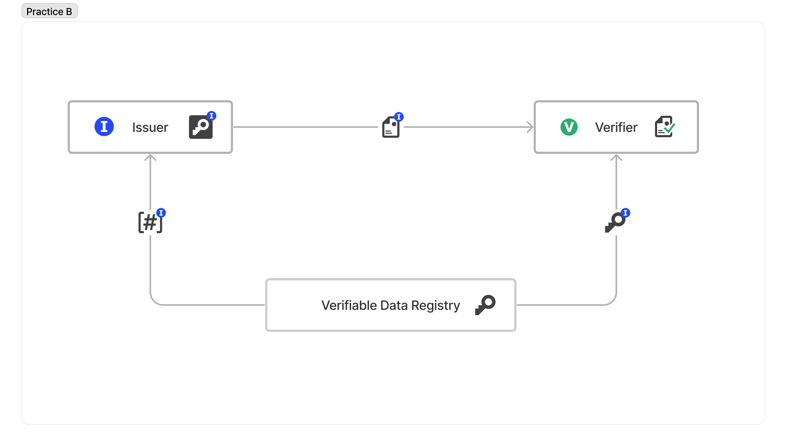

# TWDP-B: IoT機器の生成データの確認のユースケース

真正性が求められる電子化文書に対する複合機によるスキャンを例に説明する。この場合、出し手(Sender)が複合機、受け手(Receiver)が文書管理システムとなる。

- [TWDP-B: IoT機器の生成データの確認のユースケース](#twdp-b-iot機器の生成データの確認のユースケース)
  - [解決する課題](#解決する課題)
  - [どのように解決するか](#どのように解決するか)
  - [実装](#実装)
  - [メリット](#メリット)
  - [注意点](#注意点)
  - [Trusted Webの目指すべき方向性との対応](#trusted-webの目指すべき方向性との対応)
  - [アーキテクチャとの対応](#アーキテクチャとの対応)

## 解決する課題

　スキャンされた電子化文書の保管に際し、真正性を保つため、特定の複合機でスキャンされて以降、改ざんがされておらず、当該複合機でスキャンされた文書であることが検証可能な仕組みが必要である。

## どのように解決するか

　出し手(Sender)と受け手(Receiver)が１対１でデータをやり取りするアプローチを行う。

　複合機で保管される秘密鍵を用いてスキャンした電子化文書を電子証明書の形式で送信する。電子化文書にデジタル署名を付与し、スキャン以後の改ざんの検知が可能とする。また、送信する際には出し手(Sender)と受け手(Receiver)間で相互に認証し、安全な通信路を確保する。

## 実装

秘密鍵保管の「TPM（Trusted Platform Module）」、電子証明書フォーマットである「VC（Verifiable Credentials）[^1]」、そして、分散型識別子である「DID(Decentralized Identifiers)[^2]」を活用することで、電子化文書にデジタル署名を付与し、スキャン以後の改ざんの検知が可能な仕組みを実現できる。

（手順）

* 複合機のTPM2.0から暗号鍵ペアを生成し、秘密鍵を安全に管理する
* 出し手(Sender)と受け手(Receiver)間で、事前のメッセージ認証を行う。(事前に共有された秘密情報からHMAC 値を計算し、初回通信時にHMAC 値を含め、検証する）
* 電子化文書をVCの形式で受け手(Receiver) のストレージに送信する
* DIDに基づく公開鍵認証により、VCの署名検証を行う

## メリット

* 文書のデジタル保管を実現するために、電子化文書の監査証跡（いつ、誰が、どのデバイスで生成した）を確認できる。
* DID Registryにあらかじめ識別子と公開鍵情報をあらかじめ登録することで、プロビジョニングを完全自動化することができる。
   
## 注意点

* 通信プロトコルにMQTTを用いる場合、最大メッセージサイズは256MBであるので、これよりも大きなサイズのスキャンデ
ータを送る場合は、複数のスレッドに分割して送信することが必要となる。
* 複数の受け手(DID)に送信する際に、送信先のDIDがどのサービスに紐づくかは、UI上で表現する必要がある。

## Trusted Webの目指すべき方向性との対応

* ユーザ（自然人又は法人）自身が自らに関連するデータをコントロールすることを可能
  * 該当なし
* データのやり取りにおける合意形成の仕組みを取り入れ
  * 該当なし
* その合意の履行のトレースを可能
  * VDRによるデータの送受信の記録
* 検証（verify）できる領域を拡大する
  * 特定の複合機からのスキャンを確認

## アーキテクチャとの対応

* Entity
  * 従業員、メーカー
* Verifiable Identity	
  * 従業員情報
* Verifiable Data	
  * スキャン文書
* Verifiable Messaging	
  * DIDComm[^3]
  * VDR
* Verifiable Data Community	
  * メーカー

[^1]: Verifiable Credentials Data Model v1.1 https://www.w3.org/TR/vc-data-model/
[^2]: Decentralized Identifiers (DIDs) v1.0 https://www.w3.org/TR/did-core/
[^3]: DIDComm Messaging v2.0 https://identity.foundation/didcomm-messaging/spec/v2.0/
