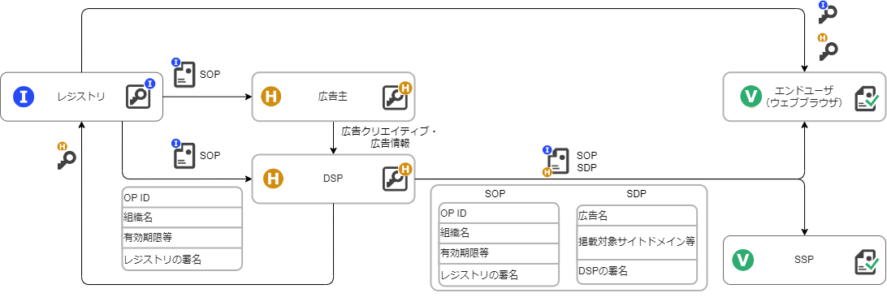
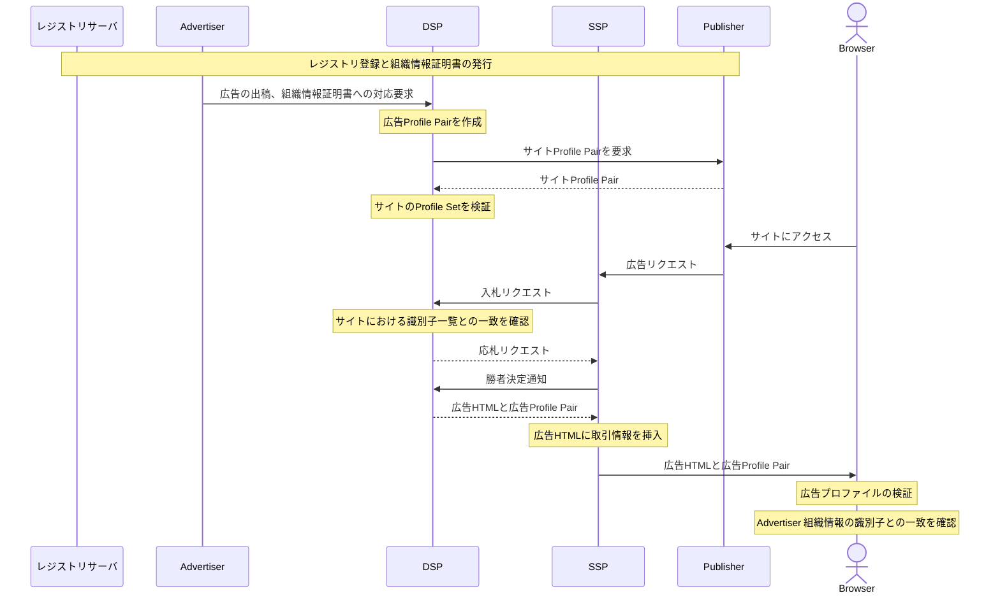

# 運用型広告取引におけるユースケース

運用型広告取引における、コンテンツの発信者情報を検証可能な形で付与するユースケースを例に説明する。この場合、出し手（Sender）が組織のレジストリサーバ運用者と広告主・広告仲介事業者（DSP: Demand-Side Platform）、受け手（Receiver）がブラウザ、メディア・広告仲介事業者（SSP: Supply-Side Platform）となる。

- [運用型広告取引におけるユースケース](#運用型広告取引におけるユースケース)
  - [解決する課題](#解決する課題)
  - [広告主の課題](#広告主の課題)
  - [メディアの課題](#メディアの課題)
  - [生活者の課題](#生活者の課題)
  - [どのように解決するか](#どのように解決するか)
    - [解決するための要件と技術選定](#解決するための要件と技術選定)
  - [実装](#実装)
    - [前提](#前提)
    - [シーケンス](#シーケンス)
  - [メリット（ペインポイントの解消）](#メリットペインポイントの解消)
  - [注意点](#注意点)
  - [Trusted Webの目指すべき方向性との対応](#trusted-webの目指すべき方向性との対応)
  - [アーキテクチャとの対応](#アーキテクチャとの対応)

## 解決する課題

　RTB（Real Time Bidding）による運用型インターネット広告の仕組みは信頼性が十分に担保できているとは言えない状態にあり、Web広告市場に参画する事業者が、取引相手の検証をしたうえで、広告取引ができる仕組みが必要である。

## 広告主の課題

- 広告主は、広告配信プラットフォームが、自社の広告が掲載されるウェブサイトの信頼性・健全性を担保している前提で広告発注するものの、ブランド棄損やアドフラウドなどの問題が発生している。

## メディアの課題

- 不適切あるいは悪意あるメディアにも広告費が流れることで、健全なメディアにとって事業継続の問題が発生している。

## 生活者の課題

-  不適切あるいは悪意ある広告が判別しにくいことで、生活者が不快な体験をしたり、フィッシング詐欺サイトなど悪意あるサイトに誘導されるなどの問題が発生している。

## どのように解決するか

　広告主やメディアの実在性と広告の信頼性に係る資格保有等を第三者が事前に確認し、広告主やメディアの組織とその資格保有等を証明するデジタル証明書と、広告情報を含むデジタル証明書を活用し、広告主やメディアの真正性だけでなく、広告情報や広告取引情報を検証可能とする。これにより適正な運用型広告取引を実現可能にすると共に、生活者に伝えるべき情報（広告に関わる品質と信頼性の向上に向けた取り組みや、プライバシーポリシーあるいは企業理念・情報発信ポリシーなど）も表示できるようになる。

### 解決するための要件と技術選定

上記のペインポイントを解決するための要件に対し、解決に資する技術選定を行った。

1. 情報発信者の真正性と信頼性が検証可能となること
    > 広告を出稿する法人（広告主）とメディアの双方が、レジストリサーバ運営者に組織情報や信頼性確認に資する資格情報（デジタル広告の掲載品質と信頼性に関するものを含むがそれに限らない）の登録申請を行い、レジストリサーバ運営者が登録者の実在性や記載内容の確認などを、第三者機関への照会を含めて行ったうえで、申請者の組織情報を登録し、その識別子および組織情報を記載した証明書を発行する。

2. 広告主、広告仲介事業者、メディア企業がRTB取引内でグローバルに一意に識別できること
    > RTB取引において、SSPはメディア企業およびSSP自身の組織情報の識別子を、DSPは広告主およびDSP自身の組織情報の識別子をそれぞれRTB bit request（広告の入札依頼）およびRTB bid response（広告の応札）に記載し、双方相手方の組織情報の識別子を確認して取引を行う。  広告主側（広告主およびDSP）は、メディアがサイトに掲載したメディアの組織証明書を事前検証した上でRTB bit request記載のメディア識別子との一致を検証する。メディア側（メディアおよびSSP）は、RTB bid response記載の広告主の識別子（を含むRTB記載情報）をSSPが広告マークアップ（iframeで読み込まれるHTML）に挿入した上でブラウザでの事後検証をさせることで、不正な広告主による取引を検知可能とする。

3. 生活者から広告主が偽物でないことが確認できること
    > ブラウザは、DSPが広告マークアップに挿入した、Verifiable Credentials準拠の広告情報および広告主情報の検証を行い、生活者がそれを確認可能とする。

上記選定技術を用いた構成（広告主をメディア側が検証する部分）を図示したものが以下となる。

Issuerがレジストリ、Holderが広告主側（広告主、DSP）、Verifierがメディア側（メディア、SSP、エンドユーザ）となるように、レジストリの発行した組織情報証明書と、（広告主を代理して）DSPが発行する広告情報に関する証明書をエンドユーザに提示するように実装を行う。その際のおおまかなデータのやり取りの流れは以下のようになる。

1. IssuerであるレジストリサーバがHolderであるDSPに対して、組織の電子署名を施した組織情報証明書を発行する = Verifiable Credentials[^1]の発行
2. HolderであるDSPは広告主から得た広告クリエイティブや広告情報をもとに、広告情報証明書（SDP）を発行し、広告主の組織情報証明書（SOP）とともに、広告マークアップに埋め込む
3. SSPは広告主のOP IDなどのRTB取引記載情報を広告マークアップに埋め込む
4. 広告配信サーバを経由してVerifierであるエンドユーザが広告と共に広告主の組織情報証明書（SOP）、広告情報証明書（SDP）およびRTB取引記載情報を受け取る
5. エンドユーザ（ブラウザ）はまず、組織情報証明書（SOP）をIssuerであるレジストリサーバの公開鍵（ブラウザが事前に保有）で検証する。次に広告情報証明書（SDP）をHolderであるDSPの公開鍵（SOP内に含めたものを利用）で検証する。最後に、RTB取引記載情報がSOP、DSP記載情報と矛盾がないことを確認する。

## 実装

電子証明書フォーマットである「VC（Verifiable Credentials）」を活用することで、広告情報を示す文章にデジタル署名を付与し、広告主を示す情報に広告取引における第三者認証などの資格情報を含めることで、広告主の真正性に加え、信頼性も確認できる仕組みを実現できる。

### 前提
- 広告主・メディアと広告取引事業者はレジストリサーバに登録し、組織情報にレジストリサーバの署名がなされた組織情報証明書を事前に取得する。

### シーケンス

1. 広告主は事前に取得した組織情報証明書をDSPに事前提出する。（あるいはDSPがレジストリサーバから取得する。）
2. （掲載する広告のクリエイティブに含める画像などを準備するタイミングで）SOPとその広告情報を含む広告プロファイルペアを生成する。
3. 利用者がサイトにアクセスし広告枠のインプレッションが発生する。
4. メディアのサイトから SSPに広告リクエスト、SSP から（複数の）DSP にRTB bid Requestが送られる。
5. DSPからSSPにRTB bid Responseが返され、SSP 側で指定時間内に応札されたものから勝者を決定し勝者に対して通知する。
6. 落札したDSPは広告プロファイルペアを含めた広告クリエイティブを返し、ブラウザに表示される。
7. ブラウザで、広告プロファイルペアの検証を行う。
8. ブラウザでの広告表示時に広告主 組織情報の識別子 と広告の一致を確認する。

## メリット（ペインポイントの解消）

 - 広告主のメリット
    - 信頼できるメディアにのみ広告を掲載できる。
    - 悪意あるメディアへの広告費流出を抑制することができる；
      > [広告主の課題](#広告主の課題)の解消

 - メディアのメリット
    - 悪意あるメディアへの広告費流出を抑制することが、健全なメディアにとって事業の助けとなり、社会的に必要な信頼できる情報流通の仕組みが担保できる。
      > [メディアの課題](#メディアの課題)の解消

 - 生活者のメリット
    - 悪意ある広告が判別しやすくなる。
      > [生活者の課題](#生活者の課題)の解消

## 注意点

 - 実際に広告取引を実施すると大規模化するため、システム負荷が少ない方式が求められる
 - RTB 取引は極めて短時間での応答が求められるパフォーマンスが重要なため、データのペイロードサイズも処理内容を最小限に留める必要がある
 - 組織情報の識別子のみではなく、組織の持つ資格情報も利用して相手の信頼性を確認するかどうかについては、広告主やDSPが何を求めて取引を行うか次第であるため、取引毎の任意で決める

## Trusted Webの目指すべき方向性との対応

* ユーザ（自然人又は法人）自身が自らに関連するデータをコントロールすることを可能
  * Verifiable Credentialsを利用する法人側で保有し、veirfyにあたっては第三者機関等で実施する。
* データのやり取りにおける合意形成の仕組みを取り入れ
  * RTB取引において、広告主とメディア企業が双方の信頼性を確認するため、それぞれが相手側の組織情報の識別子保有を検証する
* その合意の履行のトレースを可能
  * 該当なし
* 検証（verify）できる領域を拡大する
  * ウェブ上でコンテンツの発信者とその信頼性の判断に資する情報をデジタル署名を用いた検証可能なデータとして付与することで検証拡大を図る

## アーキテクチャとの対応

* Verifiable Identity
  * レジストリサーバから付与された広告主、メディア、DSP、SSPの組織情報の識別子
* Verifiable Data
  * 組織情報証明書であるSOP、広告情報やサイト・記事情報に関するSDP
* Verifiable Messaging
  * DSP、SSPにおけるログ（ブラウザによるRTB記載情報の検証に失敗する場合はそのエラーレポートを含む）
* Verifiable Identity Community
  * OP CIPの組合員企業（将来的にはすべてのOP利用企業）

[^1]: Verifiable Credentials Data Model v1.1 https://www.w3.org/TR/vc-data-model/
