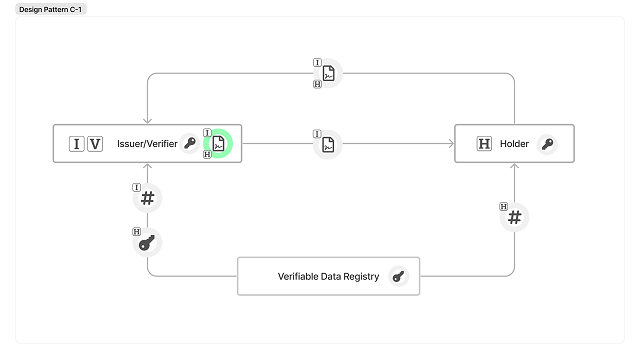

# Cパターン(本人であることの証明)

IssuerとVerifierが同じエンティティのパターン。
Issuer/VerifierがHolderに対して電子署名を施した証明書を発行し、Holderは発行された証明書に自身の電子署名を施したものを、Issuer/Verifierに提示することにより、HolderはIssuer/Verifierに対して、Holderであることの証明を行うことができる。
Issuer/Verifierは自身の電子署名と、Holderの電子署名を検証することにより、対象のエンティティが確かに証明書を発行したHolderであることを確認することができる。

サービス提供者による利用者の認証や、アクセス権の管理等のユースケースが考えられる。

