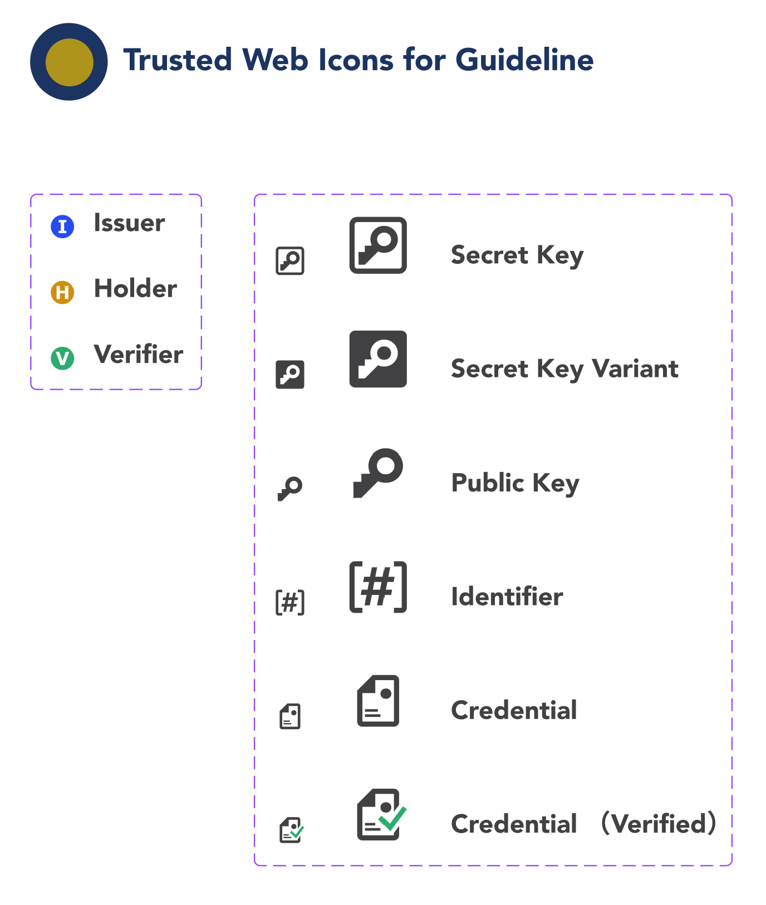

# Trusted Web 実装ガイドライン

Trusted Webは、既存のインターネットとウェブというインフラの上に新たなTrustの枠組みをオーバーレイで付加することを目指します。Trusted Web実装ガイドラインは利用者から見てTrusted Webの目指すべき方向性に即した設計や実装する際のプラクティスとして利用することができます。

[https://trustedweb.go.jp/](https://trustedweb.go.jp/)

## 用語定義

| 用語     | 解説 |
 | -------- | ---- |
 | アイデンティティ(Identity)| エンティティに関連する属性のセット  出典：ISO/IEC 24760-1 |
 | アイデンティティ管理(Identity Management)   |  組織の権限とアイデンティティに関連するその目的を実現するために使用される一連の原則、実践、プロセス、および手順。  出典：[Pan-Canadian Trust Framework](https://github.com/canada-ca/PCTF-CCP/tree/master/Version1_4)|
 | エンティティ(Entity) |  個人や組織のように、明確で独立した存在を持ち、文脈の中で立法、政策、規制を受けることができ、一定の権利、社会的及び法的責務を持つことができるもの。エンティティは、デジタルエコシステムにおいて4つの役割(すなわち、Subject、Issuer、Holder、Verifierである。)の1つ以上を実行できる。  出典：[Pan-Canadian Trust Framework](https://github.com/canada-ca/PCTF-CCP/tree/master/Version1_4) |
| 合意(Agreement)   |  ユーザが自分のデジタル・アイデンティティや属性がどのように共有されるかを理解していることを確認するもの。  出典：[UK digital identity and attributes trust framework beta version (0.3)](https://www.gov.uk/government/publications/uk-digital-identity-and-attributes-trust-framework-beta-version/uk-digital-identity-and-attributes-trust-framework-beta-version) |
 | 真正性 (Authenticity) |  データが意図された情報源から得られたものであるというプロパティ。 出典：[NIST Special Publication 800-63](https://openid-foundation-japan.github.io/800-63-4/sp800-63.ja.html#def-and-acr) |
 | 相互運用性(Interoperability) | 技術のみだけでなく、法制度、ガバナンス、組織等の社会システム全体について異なるシステム間で連携可能であること。  |
 | 属性情報 (Attribute) |  名前、生年月日、パスポート番号、資格、予防接種など、誰かまたは何かに固有または起因する品質または特徴  出典：[Open Identity Exchange "A Guide to Trust Frameworks for Smart Digital ID"](https://openidentityexchange.org/a-guide-to-trust-frameworks-for-smart-digital-id?page=glossary) |
 | DID (Decentralized Identifiers)  |  DIDとは、Decentralized Identifiers （分散型識別子）の略で、新しいタイプのグローバルに一意な識別子である。個人や組織が、自らが信頼できるシステムを使って自分の識別子を生成できるように設計されている。この新しい識別子は、デジタル署名などの暗号証明を用いて認証することにより、エンティティがその識別子を管理していることを証明することが可能。これらの識別子の使用は、さまざまな状況に応じて適切に設定が可能であり、識別子の継続的な存在を保証する中央機関に依存することなく、個人情報やプライベートデータをどの程度公開するかを制御しながら、エンティティが自分自身や自分が管理するものを識別することをサポートする。   出典：[W3C Decentralized Identifiers (DIDs) v1.0](https://www.w3.org/TR/did-core/) |
|  デジタル署名 (Digital Signature)| 公開鍵暗号技術を用いて、デジタル文書が公開鍵で特定されるエンティティが認めたものであることを確認できるデータ列  |
| トラストアンカー（Trust Anchor） |   公開鍵暗号の公開鍵 |
| トラストフレームワーク (Trust Framework) | 運用規則、スキーム規則、運用方針などの仕様、規則、協定の集合。エコシステム内においてトラストフレームワークに準拠していることを示すことができる認証プロセスや、準拠状態を維持・監査するための、ガバナンスや監査機関を含むこともある。出典：[Open Identity Exchange “A Guide to Trust Frameworks for Smart Digital ID”。](https://openidentityexchange.org/a-guide-to-trust-frameworks-for-smart-digital-id?page=glossary)  |
| 信頼 (Trust) |  事実の確認をしない状態で、相手先が期待したとおりに振る舞うと信じる度合い |
| VC (Verifiable Credentials） |  クレデンシャルとは、発行者による一つまたは複数の「発行者によって主張された属性の集合」である。検証可能クレデンシャルとは、改ざん検出が容易なクレデンシャルであり、誰が発行したかを暗号学的に検証できるものである。  出典：[W3C Verifiable Credentials Data Model 1.0](https://www.w3.org/TR/vc-data-model/) |

## アイコン集

## 実装プラクティスの説明について

TWDPは、以下の項目に沿って説明を行う。

| 項目 | 説明 | 
| ------ | ------ |
| 解決する課題 | このプラクティスが解決する課題や、このプラクティスが適用できる課題についての説明。|
| どのように解決するか | どのように課題を解決するか、どのような構成のプラクティスかについての説明。|
| 実装	| プラクティスを用いてどのように実装するかについての説明。 |
| メリット	| このプラクティスにおけるエンティティ毎の利点の説明 |
| 注意点	| このプラクティスを適用する際の注意点 |

## プラクティス一覧

* [Issuerが発行された証明書をHolderがVerifierに提示](./A_パターン/README.md)
* [エンティティ（人やモノ）が自身の生成するデータのやり取り](./B_パターン/README.md)

## Trusted Webの目指すべき方向性

Trusted Webが実現を目指すTrustの仕組みは、特定のサービスに過度に依存せず、

* ユーザ（自然人又は法人）自身が自らに関連するデータをコントロールすることを可能とし、
* データのやり取りにおける合意形成の仕組みを取り入れ、その合意の履行のトレースを可能としつつ、
* 検証（verify）できる領域を拡大することにより、Trustの向上を目指すものである。

## Trusted Webアーキテクチャ

Trusted Webにおけるアーキテクチャは以下の構成要素からなります。

### Verifiable Data

Verifiable Dataは、デジタル署名技術を活用することにより、「対象となるデータが署名者によって確認されていること」を検証者が確認できるデータです。

### Verifiable Messaging

Verifiable Messagingは、複数のエンティティ間での確実な配送をメッセージの送受信の順序性を含め確認することができます。

### Verifiable Identity

Verifiable Identityは、検証可能かつコンテクストに応じて最低限必要な属性からなるデジタル・アイデンティティです。 Verifiable Identityによって、対象となるデータが署名者によって確認されていることを検証者が確認でき(Verifiable Dataの実現）、データのやり取りが検証できます(Verifiable Messagingの実現） 。

### Verifiable Data Community

Trusted Webでは、必要に応じて、高い確度で信頼できるエンティティ（Trusted Entity)によって運用されたアイデンティティ(Trusted Identity)を起点とした信頼の連鎖を構築します。データのやり取りに関係するエコシステム参加者の下でTrusted Identityを共有することにより、信頼関係の構築を容易にします。Verifiable Data Communityは、このような信頼の起点を含む情報を一定のガバナンス下で共有し、Verifiable Identityの確立を支援するアイデンティティの集合を指します。
